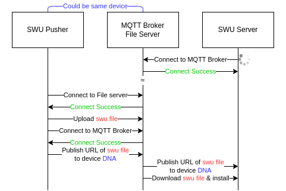

- [Overview](#overview)
- [User Guide](#user-guide)
- [How to install](#how-to-install)
  - [`swu-pusher` \& `swu-scanner`](#swu-pusher--swu-scanner)
  - [`swu-client`](#swu-client)
- [Configuration file](#configuration-file)
- [Command Line Arguments](#command-line-arguments)
  - [`swu-scanner`](#swu-scanner)
  - [`swu-pusher`](#swu-pusher)
- [Performance](#performance)
- [FAQ](#faq)
- [To-do](#to-do)

# Overview
This repo provides an OTA solution for EXMU-X261. To perform OTA updates, you need :

1. An EXMU-X261 running `swu-client` service.  
  Use `sudo systemctl status swu-client` to verify that `swu-client.service` is active.
2. A mqtt broker and file server (Go to  [docker directory](https://github.com/InnoIPA/swu-utility/tree/main/docker) for more information).
3. A development machine with `swu-pusher` installed (Could be the same machine with mqtt broker and file server).



# User Guide

- [User guide](https://github.com/InnoIPA/EXMU-X261-usermanual/blob/main/tocs/2.Software/OTA.md)

# How to install 
## `swu-pusher` & `swu-scanner`

To install `swu-pusher` on your development machine, execute

```bash
git clone https://github.com/InnoIPA/swu-utility
```
```bash
cd swu-utility
pip3 install ./
```

`swu-pusher` should be installed to `~/.local/bin/`. To verify it is available on your system, run

```bash
which swu-pusher
```

## `swu-client`

- Follow [this page](docs/rpm.md) with rpm package.

# Configuration file

By default, `swu-client` and `swu-pusher` will connect to MQTT broker at `swu-server.local`. You can change the setting by specifying a configuration file using `-f` option. We provide some [examples](https://github.com/InnoIPA/swu-utility/tree/main/src/swu_utility/config) of configuration file in this repository.

- Default setting
    ```bash
    [broker]
    host = swu-server.local
    port = 1883

    [file server]
    host = swu-server.local
    port = 8092
    ```

#  Command Line Arguments
## `swu-scanner`
- A simple utility for scanning avalible devices according config file.
```bash
usage: swu-scanner [-h] [-f CONFIG]

optional arguments:
  -h, --help            show this help message and exit
  -f CONFIG, --file CONFIG
                        path to config file
```
## `swu-pusher`
- Main utility for pushing swu file to file server & deploy the swu file to device with specific DNA.
```bash
usage: swu-pusher [-h] [-d DNA] [-m {AB,QSPI,RPM}] [-f CONFIG] image

positional arguments:
  image                 path to image file

optional arguments:
  -h, --help            show this help message and exit
  -d DNA, --dna DNA     DNA of target device
  -m {AB,QSPI,RPM}, --mode {AB,QSPI,RPM}
  -f CONFIG, --file CONFIG
                        path to config file
```

# Performance

| device |  rootfs size | boot part size | time spent |
|:------:|:------------:|:--------------:|:----------:|
|  eMMC  |    1.4GiB    |     100MiB     |    147s    |
|SD card |    1.4GiB    |     100MiB     |    116s    |
|QSPI fw |       x      |       x        |    10s     |

**Note:** We only measure the time spent on doing the update.
The time spent on downloads is ignored.

# FAQ
- What if I don't what change my hostname into `swu-server` just for this service?  
  Followiing process will add an alias mdns `swu-server.local` to the device within mqtt broker and file server.
  ```bash
  cd mdns
  sudo ./run.sh
  # or
  sudo ./install.sh
  ```

- Why `miniserve` using port 8092?   
  By reference [this page](https://www.iana.org/assignments/service-names-port-numbers/service-names-port-numbers.xhtml?search=&page=110) and chose an unassigned port.

- How to build swupdate without signed option on ubuntu?   
  Follow [this page](docs/swupdate_on_x86.md).

# To-do
- [ ] avahi-alias getting ip is not stable under complex network environment. Maybe using VLAN to refine the flow?
- [ ] Stressing test mutilple device at the same time to know the weak point. (Maybe on the bandwidth ?) 